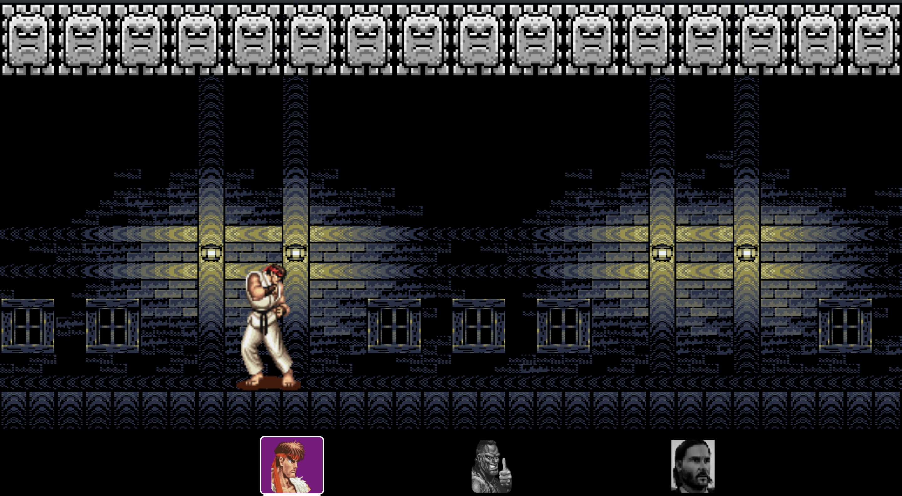
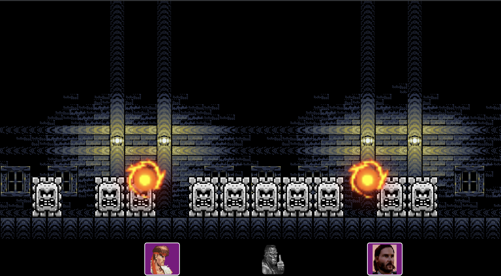

# Sprite Jam

Websocket enabled fighting game using React/Webpack/Howeler/Canvas(React-Konva)

## Instructions
clone, then `yarn` or `npm install`

Run these two processes at the same time.
`yarn dev` or `npm run dev` <- runs Webpack dev server. Connect to it on localhost:8080
`yarn server` or `npm run server` <- Runs websocket server

One computer (hopefully a common one where all players have a view of) connects to `localhost:8080`

Players pick a character on the mobile device to play at `localhost:8080/:playerName` where `:playerName` can be `ryu`, `deejay`, or `john`.

## How to Play

The objective of the game is to survive the falling blocks which will fall randomly between the `MIN_BLOCK_DROP_TIME` and `MAX_BLOCK_DROP_TIME` (ms) located in the config at `client/config.js`.

Players can punch each other with the first icon that will show on the mobile device controller screen. Landing a punch tosses an opponent `VICTIM_THROW_DISTANCE` (config, in pixels). Players hit are also stunned for a short period.

Players can also "blink" in a direction by double tapping a movement direction. Players can blink once every `BLINK_COOLDOWN` in ms.

Players lose lives when a block falls on them. The game ends if every player has died or if there is only one player left (which declares a winner!)